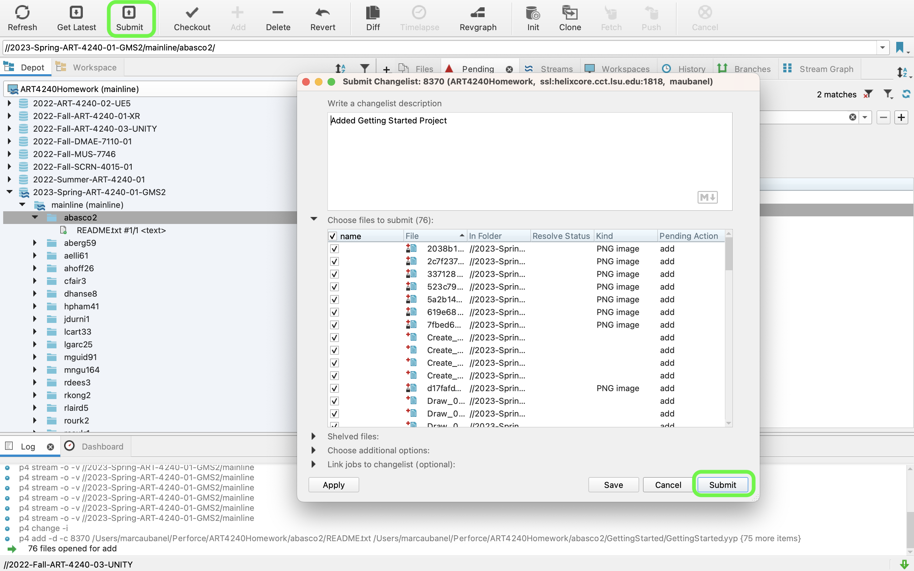

### Copying Homework

[previous](../workspaces/README.md#user-content-workspaces-in-p4v) • [home](../README.md#user-content-gamemaker-studio-2-perforce) 

Lets submit your homework to Perforce so it can be graded!

 

---

##### `Step 1.`\|`GMP`|:small_blue_diamond:

Now you need to move the **GameMaker** project folder you were working on into the **Perforce** workspace that you have just created with the single **Readme** file.  I called my project `GettingStarted`. Move the entire folder into this workspace as you will have all of your gamemaker games in this folder.

##### `Step 2.`\|`GMP`|:small_blue_diamond: :small_blue_diamond: 

Log back into **P4V** and enter your workspace (or create a new one if you are on a new computer).  Make sure you are on the **Workspace** tab. Press the <kbd>Refresh</kbd> button and make sure you now see your folder containing your **GameMaker** project.

##### `Step 3.`\|`GMP`|:small_blue_diamond: :small_blue_diamond: :small_blue_diamond:

Make sure you are in the **Workspace** tab.  Select the uppermost folder (your LSU username) and press the <kbd>Add</kbd> button.  Select `New` and type in a message describing the work done.  Press the <kbd>OK</kbd> button.

##### `Step 4.`\|`GMP`|:small_blue_diamond: :small_blue_diamond: :small_blue_diamond: :small_blue_diamond:

Go to the **Pending** tab (if you don't see it you can select **View | Pending**) to add it to the window.  You should now see the commit message you made. Your pending number will be different.

##### `Step 5.`\|`GMP`| :small_orange_diamond:

##### `Step 6.`\|`GMP`| :small_orange_diamond: :small_blue_diamond:

| `gms2.gms2perforce`\|`THE END`| 
| :--- |
| **That's All Folks!** That's it for setting up Perforce. |

<!--  -->

| [previous](../workspaces/README.md#user-content-workspaces-in-p4v)| [home](../README.md#user-content-gamemaker-studio-2-perforce) | 
|---|---|
