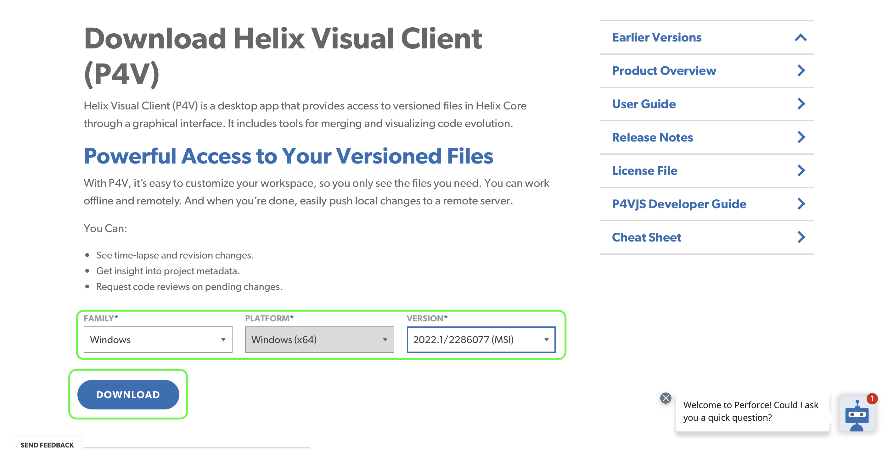
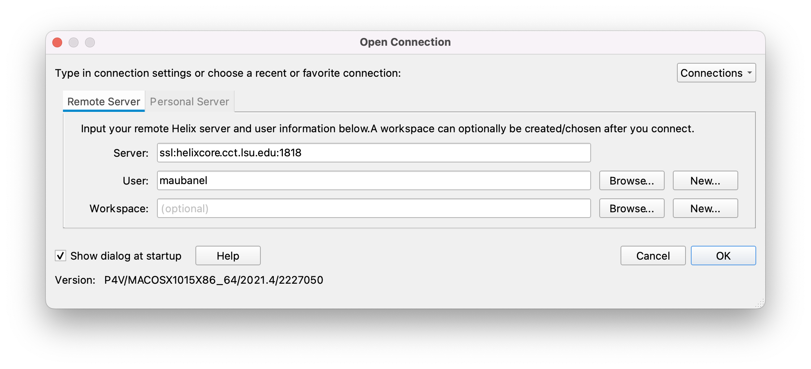
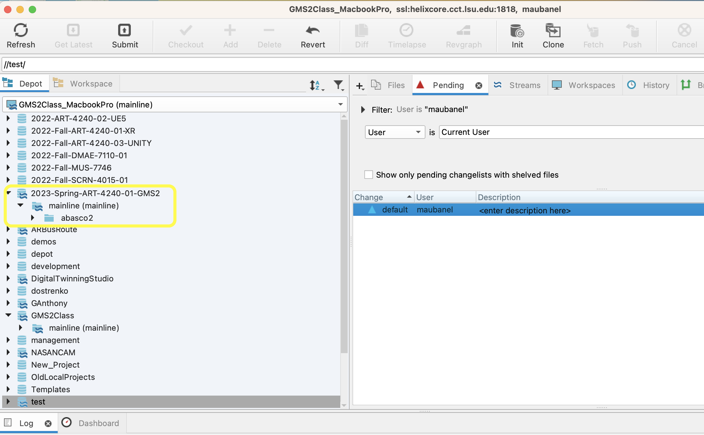

### Installing P4V

[home](../README.md#user-content-gamemaker-studio-2-perforce)• [next](../data-types/README.md#user-content-gms2-data-types)

There are three main applications to install.  **P4V** which is tthe GUI controller for source control.  **P4** which is the command line version control.  **P4Admin** for administration if you have admininstration access.  If you are not an administrator then you do not need to install **P4Admin**.

 

---

##### `Step 1.`\|`GMP`|:small_blue_diamond:

You can use Peforce on and off campus and you do not need to use a VPN.  

##### `Step 2.`\|`GMT`|:small_blue_diamond: :small_blue_diamond: 

Download [P4V](https://www.perforce.com/downloads/helix-visual-client-p4v) which is the GUI manager that should work for most issues that arise.  

##### `Step 3.`\|`GMT`|:small_blue_diamond: :small_blue_diamond: :small_blue_diamond:

Double click the `p4vinst64.msi` (.msi for pc and .dmg for mac) file. Install at least the **Helix Visual Client (P4V)** and **Command Line Client (P4)**.  The **Merge and Diff Tool** and **Administration Tool** are optional.

Then for **Server** enter `ssl:helixcore.cct.lsu.edu:1818`, **Username** use your lsu id *without* the @lsu.edu. You can select your text editor of choice or leave the default.  Press the <kbd>Next</kbd> button. Then press the <kbd>Install</kbd> button.  You can then close the screen out.

##### `Step 4.`\|`GMT`|:small_blue_diamond: :small_blue_diamond: :small_blue_diamond: :small_blue_diamond:

Run **P4V** and use the same **Server** and port by entering `ssl:helixcore.cct.lsu.edu:1818`, and use your lsu **User** id *without* the @lsu.edu. We will leave the **Workspace** blank and login to the perforce server. Press the <kbd>OK</kbd> button. It will ask you to validate the fingerprint.  That fingerprint should be `13:57:CE:06:14:E9:3A:72:84:B1:41:A3:BF:CC:17:A2:85:D7:AA:891`.  Accept this request. Use your mylsu password that you use to login to all of LSU's services. 

##### `Step 5.`\|`GMT`| :small_orange_diamond:

When it loads up go to the **Depot** tab.  This is all the projects that you have access to that are on the server (cloud). If you have already used it you will see other **Depot's** but everyone should see a depot called `2023-Spring-ART-4240-01-GMS2` and should have access to a folder with your username inside the `mainline` stream and a single **README.txt** file in it.

##### `Step 6.`\|`GMT`| :small_orange_diamond: :small_blue_diamond:

You can now run P4V and create a new **Workspace** which is the next step.

