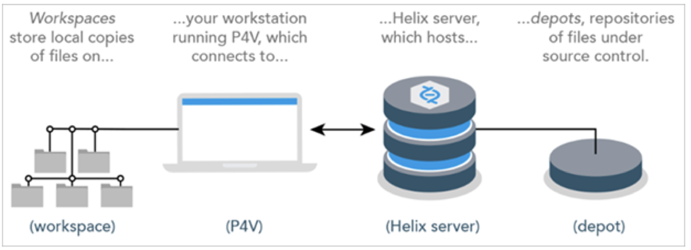
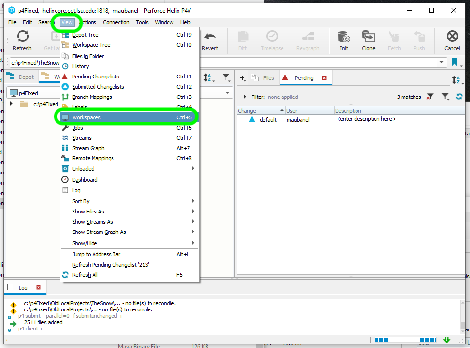
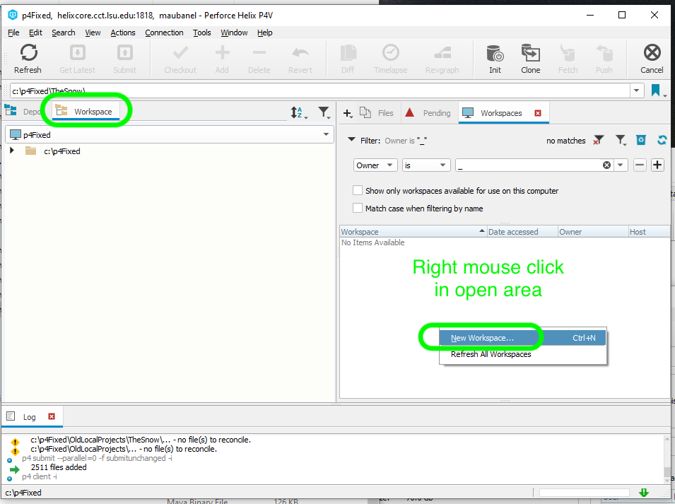
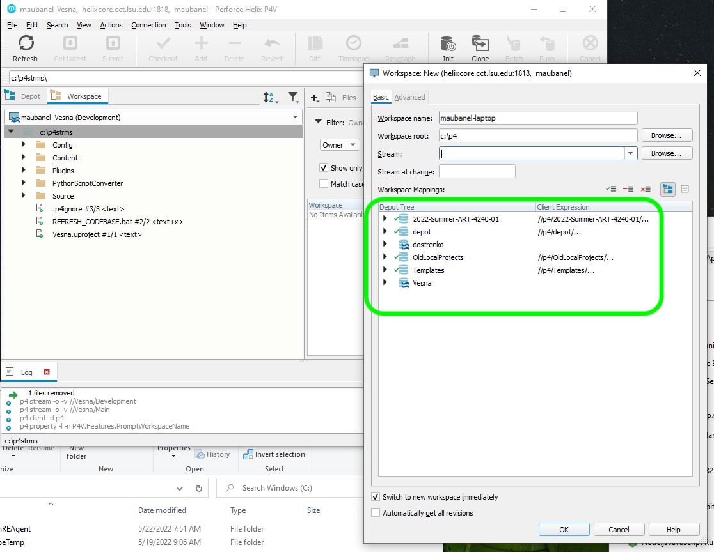
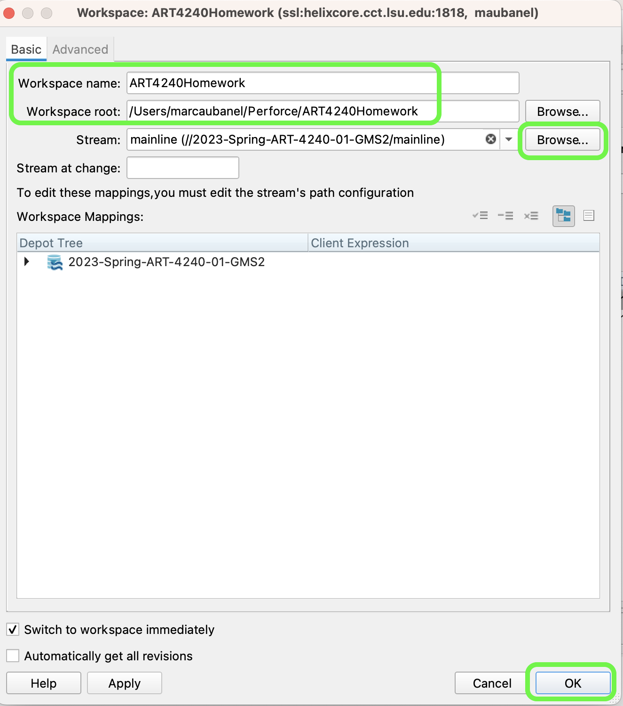
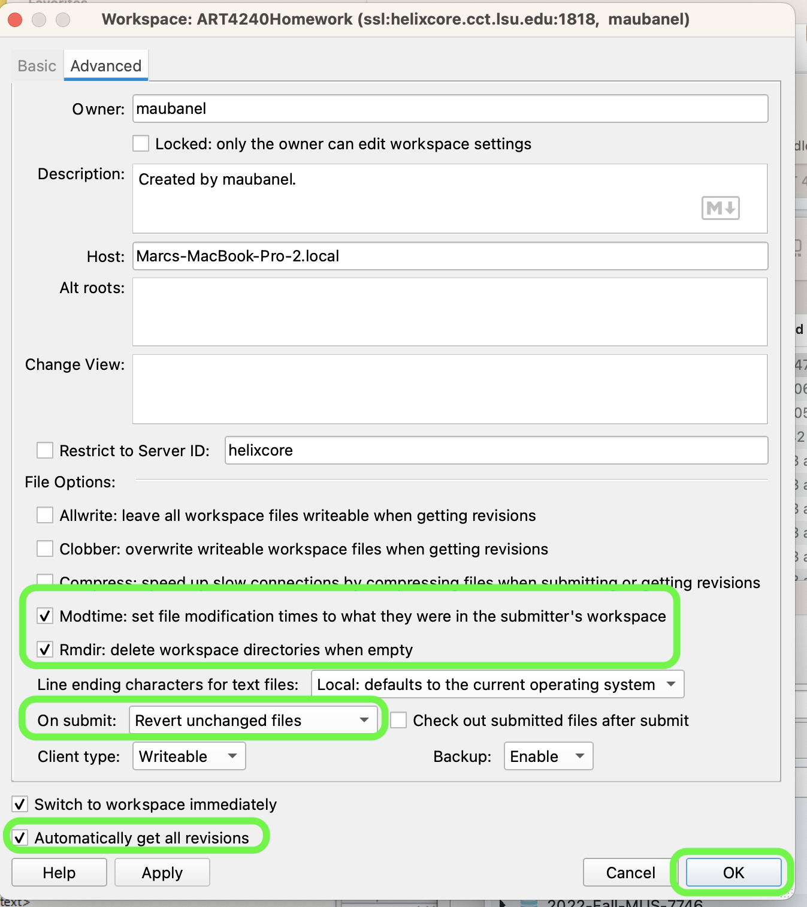
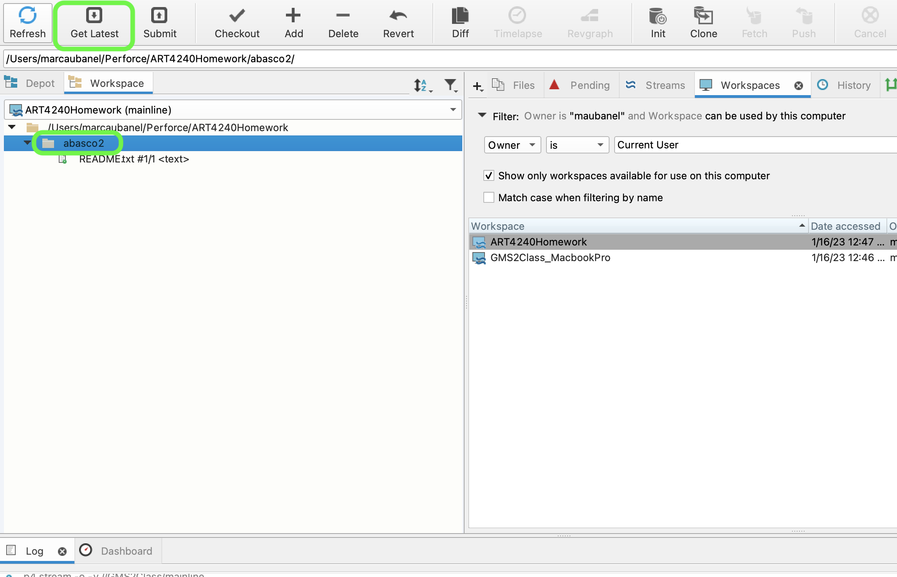
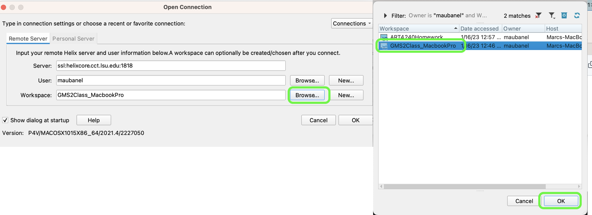
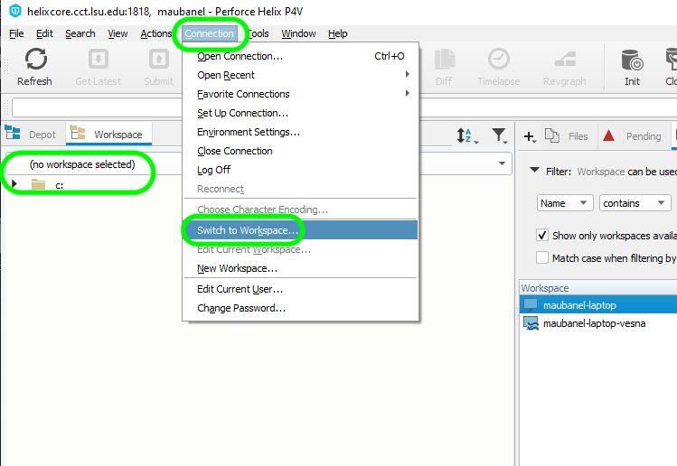

### Workspaces in P4V

[previous](../setting-up/README.md#user-content-setting-up) • [home](../README.md#user-content-gamemaker-studio-2-perforce) • [next](../homework/README.md#user-content-copying-homework)

**Depots** contain the project(s) that you have access to either read, write or both.  They live on the Helix server.  To work you need to have those files locally.  In **Perforce** this is a called a **workspace**.  You can have as many workspaces as you like but you need one workspace per stream.  Also, your workspace is only valid on a single computer, so you need a workspace for each computer you are working on.

 

---

##### `Step 1.`\|`GMP`|:small_blue_diamond:

Now open up and loginto **P4V** and open up the app.  You need to select **View | Workspaces** to select your workspaces tab.

##### `Step 2.`\|`GMP`|:small_blue_diamond: :small_blue_diamond: 

Right mouse click and on the open area in the **Workspaces** tab and select **New Workspace...**.

##### `Step 3.`\|`GMP`|:small_blue_diamond: :small_blue_diamond: :small_blue_diamond:

Now you get a pop up that has all the depots that you have permission to subscribe to. 

##### `Step 4.`\|`GMP`|:small_blue_diamond: :small_blue_diamond: :small_blue_diamond: :small_blue_diamond:

Come up with your own **Workspace name**.  I usually combine the name of the stream and name the computer it is for (laptop, desktop etc...). In this case I used `ART4240Homework`. It defaults to your user directory which will work for me, but you can change it. I used a folder name that matches the workspace `Users/marcauabanel/Perforce/ART4240Homework`. Press the <kbd>Browse</kbd> button in the **Stream** and select `//2023-SPrint-ART-4240-01-GMS2/mainline).  **Don't** press the <kbd>OK</kbd> yet.

##### `Step 5.`\|`GMP`| :small_orange_diamond:

Select the **Advanced** tab.  Set **Modtime: ...** to `true` so that the timezone of each contributor is respected.  Set **Rmdir:** to `true` so empty folders are removed.  Then select in **On submit:** `Revert unchanged files`.  Set **Automatically get all revisions** to `true`. Now select <kbd>OK</kbd> to create this new workspace.

##### `Step 6.`\|`GMP`| :small_orange_diamond: :small_blue_diamond:

Select the **Workspaces** tab and go to the top of the directory.  Press the <kbd>Get Latest</kbd> button on the top menu. This will create a directory and get all the folders in it (it might have already downloaded this when you performed the last step).  

##### `Step 7.`\|`GMP`| :small_orange_diamond: :small_blue_diamond: :small_blue_diamond:

Now you will see the one folder and file that are in this new **Workspace**. You can navigate to the folder you installed it in and see that the **Workspace** is showing you what is in the depot.  We have now succesfully set up your workspace.

##### `Step 8.`\|`GMP`| :small_orange_diamond: :small_blue_diamond: :small_blue_diamond: :small_blue_diamond:

Now next time you run **p4v** you can select **Browse** next to **Workspace:** and select the workspace you want.  In this case it is **p4** and then I will press the <kbd>OK</kbd> button.  Then you are loaded into this workspace when it opens.

##### `Step 9.`\|`GMP`| :small_orange_diamond: :small_blue_diamond: :small_blue_diamond: :small_blue_diamond: :small_blue_diamond:

If you are not in a workspace or in the wrong workspace you can switch to it by select **Connection** and then `Switch to Workspace`. You will then select the workspace you would like to switch to.

<!--  -->

| [previous](../setting-up/README.md#user-content-setting-up) | [home](../README.md#user-content-gamemaker-studio-2-perforce) | [next](../homework/README.md#user-content-copying-homework)|
|---|---|---|
