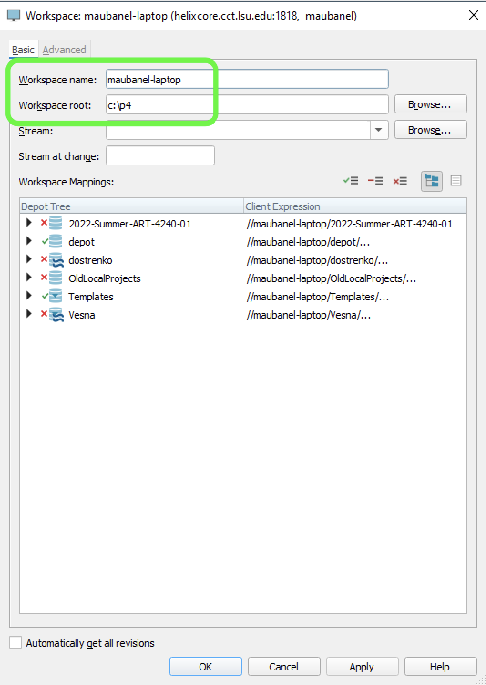
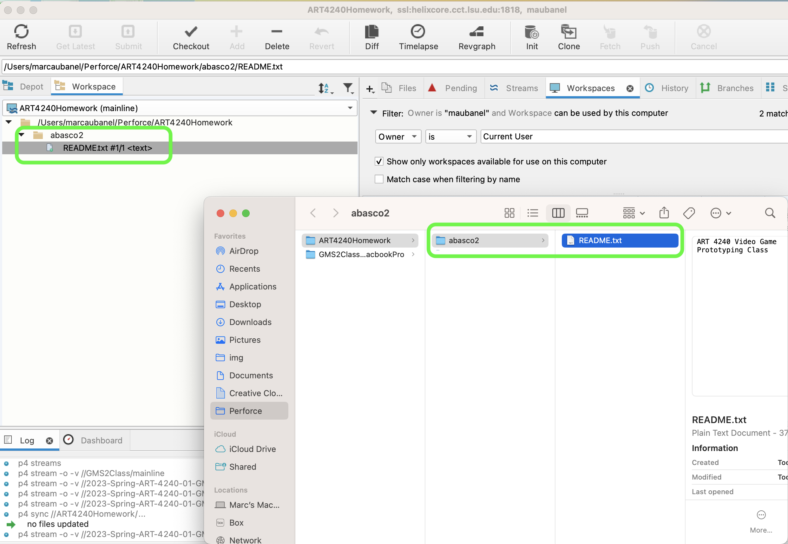
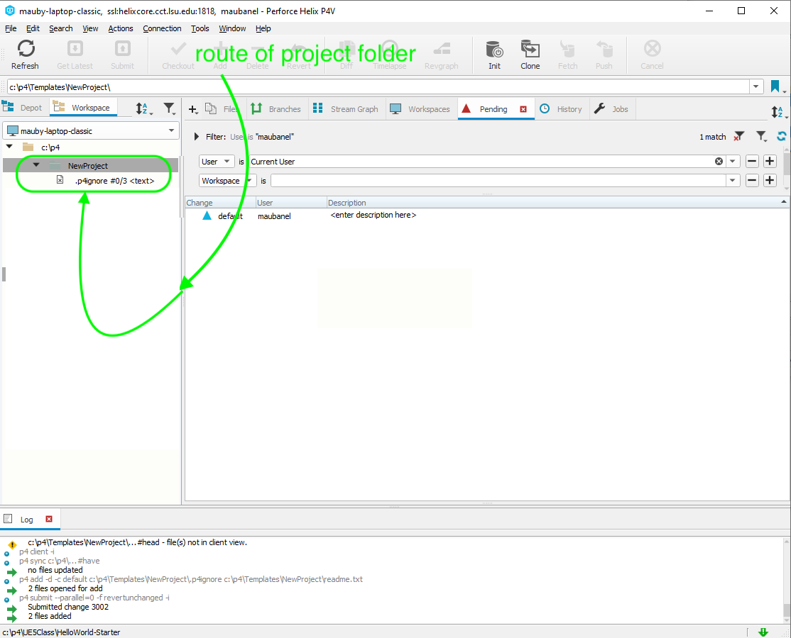
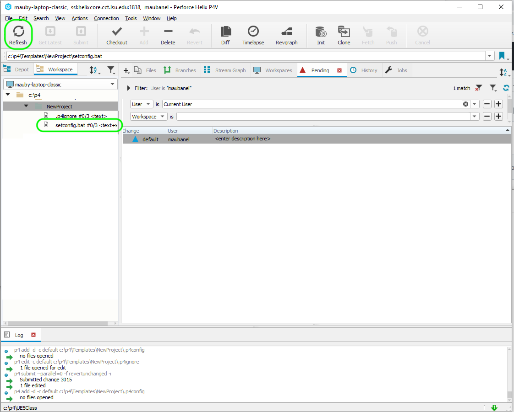
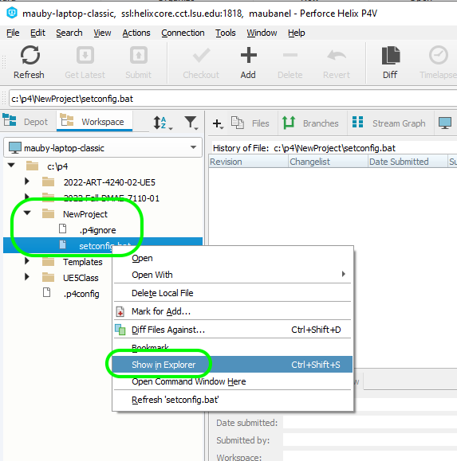
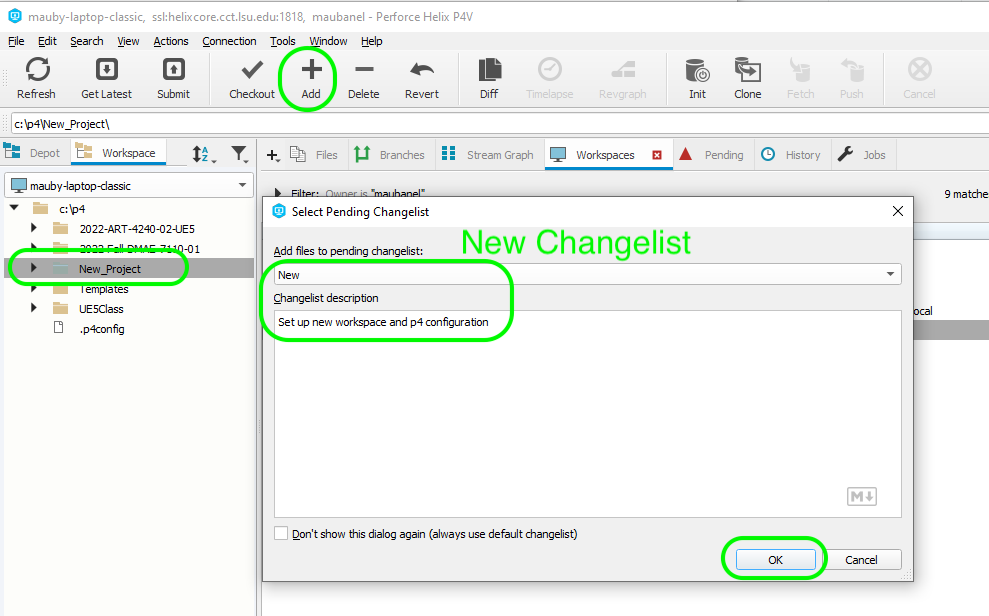
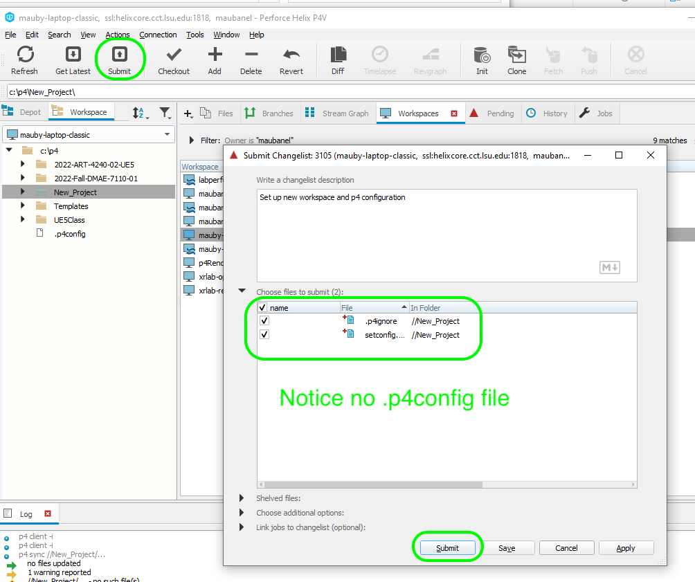
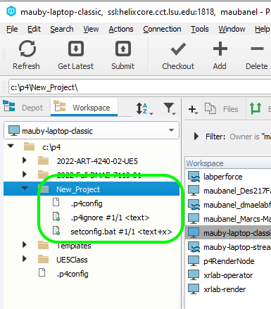
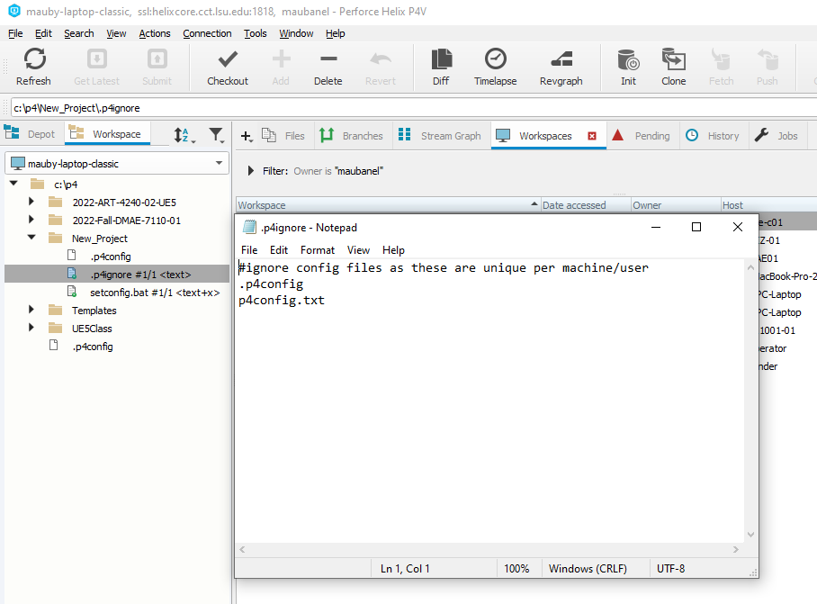
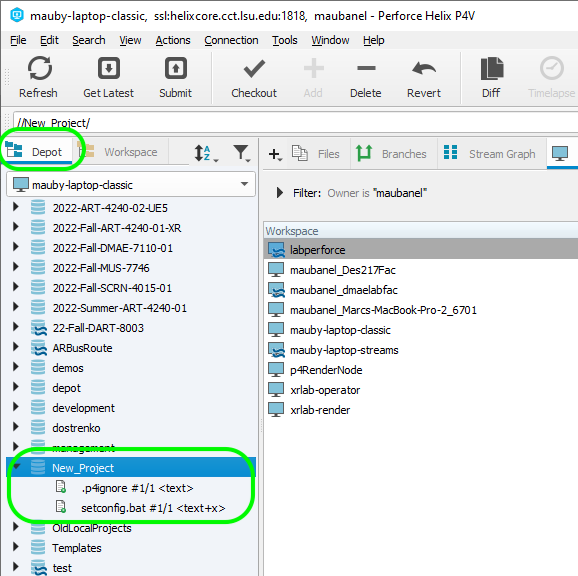

### Workspaces in P4V

[previous](../setting-up/README.md#user-content-setting-up) • [home](../README.md#user-content-gamemaker-studio-2-perforce) • [next](../data-types/README.md#user-content-gms2-data-types)

**Depots** contain the project(s) that you have access to either read, write or both.  They live on the Helix server.  To work you need to have those files locally.  In **Perforce** this is a called a **workspace**.  You can have as many workspaces as you like but you need one workspace per stream.  Also, your workspace is only valid on a single computer, so you need a workspace for each computer you are working on.

 

---

##### `Step 1.`\|`GMP`|:small_blue_diamond:

Now open up and loginto **P4V** and open up the app.  You need to select **View | Workspaces** to select your workspaces tab.

##### `Step 2.`\|`GMP`|:small_blue_diamond: :small_blue_diamond: 

Right mouse click and on the open area in the **Workspaces** tab and select **New Workspace...**.

##### `Step 3.`\|`GMP`|:small_blue_diamond: :small_blue_diamond: :small_blue_diamond:

Now you get a pop up that has all the depots that you have permission to subscribe to. 

##### `Step 4.`\|`GMP`|:small_blue_diamond: :small_blue_diamond: :small_blue_diamond: :small_blue_diamond:

Come up with your own **Workspace name**.  I usually combine the name of the stream and name the computer it is for (laptop, desktop etc...). In this case I used `ART4240Homework`. It defaults to your user directory which will work for me, but you can change it. I used a folder name that matches the workspace `Users/marcauabanel/Perforce/ART4240Homework`. Press the <kbd>Browse</kbd> button in the **Stream** and select `//2023-SPrint-ART-4240-01-GMS2/mainline).  **Don't** press the <kbd>OK</kbd> yet.

##### `Step 5.`\|`GMP`| :small_orange_diamond:

##### `Step 6.`\|`GMP`| :small_orange_diamond: :small_blue_diamond:

Now you can pick a **Workspace name:** starting with your P4 user name and the device I am using. I set mine to `maubanel-laptop`.  Try not to use spaces in your names as it will make it easier if you have to use command line.

Select a folder to place it in.  I am putting it in the root of my only drive `c:\p4`. This folder does not have to exist as **P4V** will create it for you. Don't make the name too long.

##### `Step 7.`\|`GMP`| :small_orange_diamond: :small_blue_diamond: :small_blue_diamond:

Select the **Advanced** tab.  Set **Modtime: ...** to `true` so that the timezone of each contributor is respected.  Set **Rmdir:** to `true` so empty folders are removed.  Then select in **On submit:** `Revert unchanged files`.  Set **Automatically get all revisions** to `true`. Now select <kbd>OK</kbd> to create this new workspace.

##### `Step 8.`\|`GMP`| :small_orange_diamond: :small_blue_diamond: :small_blue_diamond: :small_blue_diamond:

Select the **Workspaces** tab and go to the top of the directory.  Press the <kbd>Get Latest</kbd> button on the top menu. This will create a directory and get all the folders in it.  Be patient, this could take a while if the project is large.

##### `Step 9.`\|`GMP`| :small_orange_diamond: :small_blue_diamond: :small_blue_diamond: :small_blue_diamond: :small_blue_diamond:

Now you will see all the **Depots** that you subscribed to in this **Workspace** in the folder you set it up in.

##### `Step 10.`\|`GMP`| :large_blue_diamond:

Now next time you run **p4v** you can select **Browse** next to **Workspace:** and select the workspace you want.  In this case it is **p4** and then I will press the <kbd>OK</kbd> button.  Then you are loaded into this workspace when it opens.

##### `Step 11.`\|`GMP`| :large_blue_diamond: :small_blue_diamond: 

If you are not in a workspace or in the wrong workspace you can switch to it by select **Connection** and then `Switch to Workspace`. You will then select the workspace you would like to switch to.

##### `Step 12.`\|`GMP`| :large_blue_diamond: :small_blue_diamond: :small_blue_diamond: 

You need to make sure the is a `.p4ignore` file in the root of the project. If you are going to be adding an existing project to this folder you can download a preconfigured file [.p4ignore](../files/.p4ignore) by right clicking on **Raw** and selecting **Save As** and call it `.p4ignore` (very important to have the `.`.  Place it in the root of your project folder accordingly.

##### `Step 13.`\|`GMP`| :large_blue_diamond: :small_blue_diamond: :small_blue_diamond:  :small_blue_diamond: 

Now there is a final step. We need to make sure that your workspace is set up every time you run **P4V**.  Download [setconfig.bat](../files/setconfig.bat) by right clicking on **Raw** and selecting **Save As** and call it `setconfig.bat`. Put it in the same directory as the **.p4ignore** file. Press the **Refresh** button in **P4V** and you should see the folder.

##### `Step 14.`\|`GMP`| :large_blue_diamond: :small_blue_diamond: :small_blue_diamond: :small_blue_diamond:  :small_blue_diamond: 

Select in **P4V** with the right mouse button the **setconfig.bat** file and select **Show In | Show in Explorer**. If **Windows Protect** comes up and the select **More info** and the <kbd>Run Anyway</kbd>. 

##### `Step 15.`\|`SUU&G`| :large_blue_diamond: :small_orange_diamond: 

Double click in **Explorer** the **setconfig.bat** batch file. If windows complains about the file press **More info** then press the <kbd>Open Anyway</kbd> button. Enter the **username** used to login to **P4V**.  This should be your lsu user name without the @lsu.edu.  The back in **P4V** get to your **Workspace** tab (Press **View | Workspace** to get it on your menu bar) and double click on your workspace.  Copy the **Host:** then in command prompt press the right mouse button to paste it into the command line. Press the <kbd>Enter</kbd> key.  Repeat for the actual **Workspace** name. Press <kbd>Enter</kbd> again and you will get the output of `p4 set`.  We should have the **P4Client**, **P4CONFIG**, **P4Host**, **P4IGNORE**, **P4PORT** and **P4USER** set.  

Please note that as long as you do not change the order of files this config file will always run ensuring that you are set up correctly in **P4V** moving forward.

https://user-images.githubusercontent.com/5504953/191112088-026fb56a-588e-4a55-a529-876095b25bb1.mp4

##### `Step 16.`\|`SUU&G`| :large_blue_diamond: :small_orange_diamond:   :small_blue_diamond: 

Now we need to add these files we created to **Perforce**.  Press the <kbd>+ Add</kbd> button and select a **New** changelist.  Add an appropriate message and press the <kbd>OK</kbd> button.

##### `Step 17.`\|`SUU&G`| :large_blue_diamond: :small_orange_diamond: :small_blue_diamond: :small_blue_diamond:

Put the cursor on the project folder in **P4V** and select the <kbd>Submit</kbd> button. This will bring up the changelist you created and press the popped up kbd>Submit</kbd> button. 

##### `Step 18.`\|`SUU&G`| :large_blue_diamond: :small_orange_diamond: :small_blue_diamond: :small_blue_diamond: :small_blue_diamond:

Notice that the .p4ignore and setconfig.bat are checked into the project as they have a small green check mark.  Notice that the **.p4config** file does not have a green checkmark.  That is becuase the `.p4ignore` file is stopping that file from being uploaded to the depot and being shared with other users.

##### `Step 19.`\|`SUU&G`| :large_blue_diamond: :small_orange_diamond: :small_blue_diamond: :small_blue_diamond: :small_blue_diamond: :small_blue_diamond:

Now if you select the **Depot** tab you can see what is up on the server (and will be seen by other users when they press **Get Latest**).  Notice that it has the two files with the checkmark but not the `.p4config` file which is left off because of the ignore file.

| [home](../README.md#user-content-p4v) |
|---|
